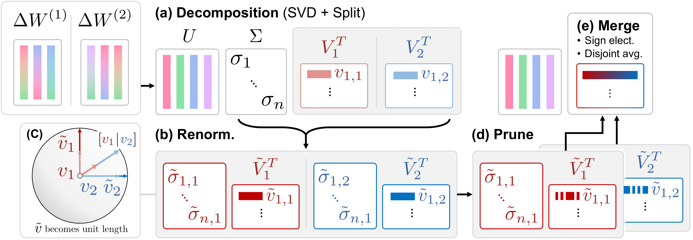

# Decom-Renorm-Merge (DRM)

Implementation of **Decom-Renorm-Merge (DRM)** from our paper: [Decom-Renorm-Merge: Model Merging on the Right Space Improves Multitasking](https://arxiv.org/abs/2505.23117).

DRM is a model merging technique that combines the capabilities of multiple fine-tuned models into a single multitasking model through a shared representation space.




## ✨ Features

*   Implementation of both **DRM-V** (`vertical`) and **DRM-H** (`horizontal`).
*   Support for a wide range of Hugging Face `transformers` models, including decoder-only, encoder-only, and encoder-decoder architectures.
*   Support for merging both fully fine-tuned models and PEFT models (e.g. LoRA).
*   Highly configurable merging process via a single YAML file.
*   Pytorch-based, designed for clarity and extensibility.

## 🚀 Getting Started

### 1. Installation

First, clone the repository:
```bash
git clone https://github.com/yophis/decom-renorm-merge.git
cd decom-renorm-merge
```

Next, create a virtual environment (Python 3.10 is recommended):
```bash
python -m venv drm
source drm/bin/activate
```

Finally, install the required dependencies:
```bash
pip install -r requirements.txt
```

### 2. Usage

The merging process is controlled by a single command that points to a configuration file.

1.  **Prepare a configuration file.** Create a `.yaml` file (e.g., `config.yaml`) detailing the models to merge, the base model, and the DRM hyperparameters. See the section below for a detailed explanation.

2.  **Run the merging script.** Execute the main script from the root directory of the project:
    ```bash
    python -m drm.merge_models --config-path /path/to/your/config.yaml
    ```

After the script finishes, the merged model will be saved to the directory specified by `save_path` in your configuration file.

## ⚙️ DRM Configuration

The entire merging process is controlled by a YAML config file. Below is an example and a detailed breakdown of all parameters.

### Example: `config.yaml`
```yaml
# A list of models to be merged.
models:
  - model: allenai/Llama-3.1-Tulu-3-8B  # HuggingFace Hub ID or local path
    parameters:
      coefficient: 1.0
  - model: allenai/Llama-3.1-Tulu-3.1-8B
    parameters:
      coefficient: 1.0

# The base model used to compute weight deltas.
base_model: allenai/Llama-3.1-Tulu-3-8B-DPO

# DRM-specific hyperparameters and settings.
merging_config:
  # The core pruning ratio for the decomposed singular matrices (U or Vh).
  # This is the main hyperparameter for DRM.
  singular_matrices_drop_rate: 0.8

  # Direction of the joint decomposition: "vertical" for DRM-V, "horizontal" for DRM-H.
  direction: vertical
  
  # Regex pattern to identify linear parameter weights (e.g. FFN layers).
  # DRM is primarily applied to these layers.
  linear_parameter_regex_pattern:
    - ".*weight.*"
    
  # Regex pattern to exclude certain linear parameters (e.g. embeddings).
  linear_parameter_ignore_regex_pattern:
    - ".*embed_tokens.*"
    - ".*lm_head.*"

  # Regex pattern of modules to ignore entirely during merging (e.g. a classification head module).
  ignore_module_regex_pattern: []
  
  # Enable disjoint averaging.
  enable_disjoint_mean: true

  # Enable sign resolution.
  enable_sign_resolution: true

  # Pruning/trim rate for non-linear modules (e.g., biases, layer norms).
  non_linear_module_entries_drop_rate: 0.0
  
  # Computation dtype for SVD. Use float32 for stability.
  dtype: float32

# Path to save the final merged model.
save_path: ./tulu-drm-v
```

### Configuration Parameters Explained

*   **`models`**: A list of models to be merged. Each entry contains:
    *   **`model`**: The Hugging Face Hub repository ID or a local path to the fine-tuned model.
    *   **`parameters.coefficient`**: (Optional, default: `1.0`) The weighting factor for this model during the final averaging step.

*   **`base_model`**: The path or Hub ID of the base model that was used for fine-tuning. This is crucial for calculating the weight deltas (`fine_tuned_model - base_model`).

*   **`merging_config`**: A dictionary of parameters that control the DRM algorithm.
    *   **`singular_matrices_drop_rate`**: The fraction of entries to prune (zero out) in the decomposed and renormalized singular matrices (`U` or `V`). This is the primary hyperparameter for controlling sparsity and performance in DRM. A value of `0.8` means 80% of the entries will be pruned, keeping the top 20%.
    *   **`direction`**: Determines the SVD strategy.
        *   `"vertical"`: Concatenates weight deltas row-wise (DRM-V). Aligns models into a shared *row* space.
        *   `"horizontal"`: Concatenates weight deltas column-wise (DRM-H). Aligns models into a shared *column* space.
    *   **`linear_parameter_regex_pattern`**: A list of regex patterns used to identify the 2D weight matrices (e.g., `mlp.fc1.weight`) where DRM will be applied.
    *   **`linear_parameter_ignore_regex_pattern`**: A list of regex patterns to *exclude* from the DRM process, even if they match the pattern above. This is useful for avoiding modifications to embedding or language model head layers.
    *   **`ignore_module_regex_pattern`**: A list of regex patterns to completely exclude certain modules from the entire merging process.
    *   **`enable_disjoint_mean`**: If `true`, uses disjoint averaging (zeros are ignored) from TIES-Merging for the final merge.
    *   **`enable_sign_resolution`**: If `true`, resolves sign conflicts across models using the method from TIES-Merging.
    *   **`non_linear_module_entries_drop_rate`**: The pruning ratio for all other parameters not matched as linear weights (e.g., biases, LayerNorm weights).
    *   **`dtype`**: The data type (`float32`, `bfloat16`, `float16`) to use for the SVD computation. `float32` is recommended for numerical stability.

*   **`save_path`**: The local directory where the final merged model will be saved in Hugging Face format.

## ✍️ Citation

If you find DRM useful, please consider citing our paper:

```bibtex
@article{chaichana2025decom,
  title={Decom-Renorm-Merge: Model Merging on the Right Space Improves Multitasking},
  author={Chaichana, Yuatyong and Trachu, Thanapat and Limkonchotiwat, Peerat and Preechakul, Konpat and Khandhawit, Tirasan and Chuangsuwanich, Ekapol},
  journal={arXiv preprint arXiv:2505.23117},
  year={2025}
}
```
